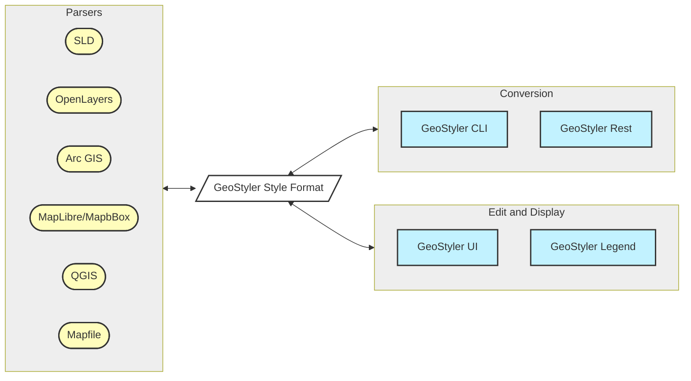

[](https://github.com/geostyler/geostyler/actions/workflows/on-push-main.yml)
[](https://github.com/geostyler/geostyler/actions/workflows/on-publish.yml)
[](https://coveralls.io/github/geostyler/geostyler?branch=main)
[](https://github.com/geostyler/geostyler/blob/main/LICENSE)

Code: [github](https://github.com/geostyler/geostyler)
Package: [npm](https://www.npmjs.com/package/geostyler)
<!-- DO NOT TOUCH next line. It will be replaced auotmaticaly via RELEASE.yml -->
Documentation: [main](https://geostyler.github.io/geostyler/main/index.html) / [latest](https://geostyler.github.io/geostyler/latest/index.html) / [18.1.0](https://geostyler.github.io/geostyler/v18.1.0/index.html)

Examples:
[Demo application](https://geostyler.github.io/geostyler-demo/)

Developer Guide:
[Developer Guide](#developer-guide)

[](https://discord.gg/yrXHDpcFcB)

## :rocket: GeoStyler Code Sprint 2025

We are happy to announce the next GeoStyler Code Sprint from **02.-06.06.2025** in Switzerland. Be part of it! More infos on https://geostyler.org/.

## 📆 Monthly meetings

On the first tuesday of every month, there is a video meeting on the [GeoStyler Discord](https://discord.gg/yrXHDpcFcB) at 2pm CET. The meeting is for all contributors, users or other people interested in GeoStyler.

## <a name="what-is-this-all-about"></a>What is this all about?

The GeoStyler is a generic styler for geodata*.

GeoStyler provides a set of UI Components for map styling. Just like a modular building block system all components can be stacked together to create a nice UI for your web applications. To simplify the setup, we also provide some high-level components (based on our building blocks) that already do the work for you. These include among many others `Symbolizer Editors`, `RuleTables` and a fully-fledged `StyleEditor including filters and scaleDenominators`.

Furthermore, GeoStyler allows for the translation between multiple styling formats, i.e. SLD, OpenLayers, QGIS, Mapbox. Since we are following the concept of micro packages, these translators (we call them parsers) can be used as standalone libraries, without the need to include the UI components as a dependency. Just take a look at [StyleParser Implementations](#styleparser-implementations).

\* *geodata as a single dataset (layer) not a complete map appearance.*

**If you are missing any UI components, formats or even have a custom style format, feel free to open a PR. We are happy for any kind of contributions.**

To see the GeoStyler in action have a look at the [demo application](https://geostyler.github.io/geostyler-demo/).
It demonstrates the GeoStyler UI components as a standalone application.

Every parser works as a standalone library, too. So you can easily translate between style formats.

For example a small SLD to OpenLayers-Style parser (untested code :smile:):

```js static
import SLDParser from "geostyler-sld-parser";
import OpenLayersParser from "geostyle-openlayers-parser";
const sldParser = new SLDParser();
const olParser = new OpenLayersParser();

const sldToOL = async (sld) => {
  const { output: geostylerStyle } = await sldParser.readStyle(someSld);
  const { output: olStyle } = await olParser.writeStyle(geostylerStyle);
  return olStyle;
};

export default sldToOl;
```
## <a name="installation"></a>Installation

Run

```bash
npm i geostyler
```
from within your project directory to add GeoStyler as a dependency. Please be aware of the peerDependencies that come along with GeoStyler.

Components can be used as follows:
```js static
import {wanted-geostyler-compoment} from 'geostyler';

//... your component code
render() {
  return (
    <wanted-geostyler-component
      foo=""
      bar={}
    />
  );
}
```

## <a name="geostyler-ecosystem"></a>GeoStyler - Ecosystem

The GeoStyler ecosystem is spread across multiple packages.



#### GeoStyler UI

The main package of the GeoStyler ecosystem is the UI library. It contains a collection of React components that can be used to build a styling UI for geodata. The main components are the `<Style />` or `<CardStyle />` component which serve as an entry point. The `<Style />` component is a full-featured style editor that allows users to create and edit styles for geodata. The `<CardStyle / >` component offers a streamlined and compact alternative to the `<Style / >` component, optimized for utilization within drawer or card layouts. The library also contains lots of subcomponents that can be used for particular parts of the style editing process, such as the Symbolizer `<Editor />` or the `<RuleTable >`.

#### GeoStyler Style

The UI library is built on top of the `geostyler-style`. This is the centerpiece of the GeoStyler ecosystem. The `geostyler-style` package is a TypeScript declaration that defines the GeoStyler style format. The style format is used to represent styles in a generic way that can be converted to and from other style formats. We are not trying to establish just another standard, but we need an exchange format that is flexible and highly compatible with current styling standards.

#### Parsers

The parsers make use of the `geostyler-style` package to convert between different style formats. The parsers are separate packages that can be used independently of the UI library. The parsers are used to convert between different style formats, such as SLD, OpenLayers, and Mapbox. Each parser is build on top of an interface defined in the `geostyler-style` package to make sure that read and write operations are consistent across all parsers.

#### Conversion tools

To convert between styles without a UI you can make use of conversion tools like the `geostyler-cli` or the `geostyler-rest` package. The `geostyler-cli` package is a command-line interface that uses the parsers so you can convert between different style formats directly from the command line. The `geostyler-rest` package is a REST API that is built on top of the command-line interface.

#### Legend

The `geostyler-legend` is a react component that renders a legend based on a GeoStyler style. Combined with the powers of the
parsers this allows to render a legend for a variety of style formats.

<!-- Code: https://github.com/geostyler/geostyler-demo -->

## <a name="related-projects"></a>Related projects

### <a name="typescript-declaration-files"></a>TypeScript Declaration Files

  - GeoStyler Data ([github](https://github.com/geostyler/geostyler-data) /
      [npm](https://www.npmjs.com/package/geostyler-data))
  - GeoStyler Style ([github](https://github.com/geostyler/geostyler-style) /
      [npm](https://www.npmjs.com/package/geostyler-style))

### <a name="dataparser-implementations"></a>DataParser Implementations

  - GeoJSON ([github](https://github.com/geostyler/geostyler-geojson-parser) /
      [npm](https://www.npmjs.com/package/geostyler-geojson-parser))
  - Shapefile ([github](https://github.com/geostyler/geostyler-shapefile-parser) /
      [npm](https://www.npmjs.com/package/geostyler-shapefile-parser))
  - Web Feature Service (WFS) ([github](https://github.com/geostyler/geostyler-wfs-parser) /
      [npm](https://www.npmjs.com/package/geostyler-wfs-parser))

### <a name="styleparser-implementations"></a>StyleParser Implementations

  - SLD ([github](https://github.com/geostyler/geostyler-sld-parser) /
      [npm](https://www.npmjs.com/package/geostyler-sld-parser))
  - OpenLayers Style ([github](https://github.com/geostyler/geostyler-openlayers-parser) /
      [npm](https://www.npmjs.com/package/geostyler-openlayers-parser))
  - ARC GIS Style [*.lyrx] ([github](https://github.com/geostyler/geostyler-lyrx-parser) /
      [npm](https://www.npmjs.com/package/geostyler-lyrx-parser))
  - Mapbox Style ([github](https://github.com/geostyler/geostyler-mapbox-parser) /
      [npm](https://www.npmjs.com/package/geostyler-mapbox-parser))
  - MapServer Mapfiles ([github](https://github.com/geostyler/geostyler-mapfile-parser) /
      [npm](https://www.npmjs.com/package/geostyler-mapfile-parser))
  - QGIS Style [*.qml] ([github](https://github.com/geostyler/geostyler-qgis-parser) /
      [npm](https://www.npmjs.com/package/geostyler-qgis-parser))

### <a name="more"></a>More
  - CQL Filter ([github](https://github.com/geostyler/geostyler-cql-parser) /
      [npm](https://www.npmjs.com/package/geostyler-cql-parser))
  - Legend ([github](https://github.com/geostyler/geostyler-legend) /
      [npm](https://www.npmjs.com/package/geostyler-legend))
  - CLI (Command Line Interface) ([github](https://github.com/geostyler/geostyler-cli) /
      [npm](https://www.npmjs.com/package/geostyler-cli))
  - REST Interface ([github](https://github.com/geostyler/geostyler-rest) /
      [npm](https://www.npmjs.com/package/geostyler-rest))

## <a name="developer-guide"></a>Developer Guide

For our guidelines for contributions, please take a look at [`CONTRIBUTING.md`](./CONTRIBUTING.md). Head there if you need general advice for first contributing steps (code or documentation).

More detailed information to ensure a great development experience when working on geostyler is summarized in [`DEVELOPING.md`](./DEVELOPING.md). You'll find hints with regard to developing UI components or guidance when you want to enhance (or create) parsers for style formats or data formats there.

Additionally, please read through our [code of conduct](./CODE_OF_CONDUCT.md).

We look forward to seeing you contribute soon!

## <a name="license"></a>License

GeoStyler is released under the BSD 2-Clause license. Please see the file
[`LICENSE`](https://github.com/geostyler/geostyler/blob/main/LICENSE) in the
root of this repository.

## Thanks to all contributors ❤

[](https://github.com/geostyler/geostyler/graphs/contributors)

## <a name="funding"></a>Funding & financial sponsorship

Maintenance and further development of this code can be funded through the
[GeoStyler Open Collective](https://opencollective.com/geostyler). All contributions and
expenses can transparently be reviewed by anyone; you see what we use the donated money for.
Thank you for any financial support you give the GeoStyler project 💞
