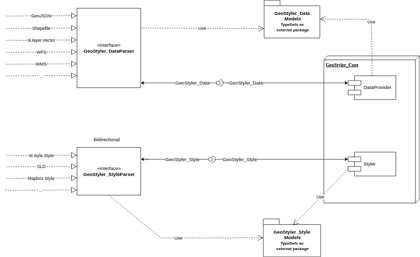

[](https://travis-ci.org/geostyler/geostyler)
[](https://greenkeeper.io/)
[](https://coveralls.io/github/geostyler/geostyler?branch=master)

Code: [github](https://github.com/geostyler/geostyler)
Package: [npm](https://www.npmjs.com/package/geostyler)

Documentation:
[master](https://geostyler.github.io/geostyler/master/index.html) /
[latest](https://geostyler.github.io/geostyler/latest/index.html) /
[4.3.0](https://geostyler.github.io/geostyler/v4.3.0/index.html)

Examples:
[Demo application](https://geostyler.github.io/geostyler-demo/)

Developer Guide:
[Developer Guide](#developer-guide)

## <a name="what-is-this-all-about"></a>What is this all about?

The GeoStyler is a generic styler for geodata*.

GeoStyler provides a set of UI Components for map styling. Just like a modular building block system all components can be stacked together to create a nice UI for your web applications. To simplify the setup, we also provide some high-level components (based on our building blocks) that already do the work for you. These include among many others `Symbolizer Editors`, `RuleTables` and a fully-fledged `StyleEditor including filters and scaleDenominators`.

Furthermore, GeoStyler allows for the translation between multiple styling formats, i.e. SLD, OpenLayers, QGIS, Mapbox. Since we are following the concept of micro packages, these translators (we call them parsers) can be used as standalone libraries, without the need to include the UI components as a dependency. Just take a look at [StyleParser Implementations](#styleparser-implementations).

\* *geodata as a single dataset (layer) not a complete map appearance.*

**If you are missing any UI components, formats or even have a custom style format, feel free to open a PR. We are happy for any kind of contributions.**

To see the GeoStyler in action have a look at the [demo application](https://geostyler.github.io/geostyler-demo/).
It demonstrates the GeoStyler UI components as a standalone application.

Every parser works as a standalone library, too. So you can easily translate between style formats.

For example a small SLD to OpenLayers-Style parser (untested code :smile:):

```js static
import SLDParser from "geostyler-sld-parser";
import OpenLayersParser from "geostyle-openlayers-parser";
const sldParser = new SLDParser();
const olParser = new OpenLayersParser();

const sldToOL = async (sld) => {
  const geostylerStyle = await sldParser.readStyle(someSld);
  const olStyle = await olParser.writeStyle(geostylerStyle);
  return olStyle;
};

export default sldToOl;
```
## <a name="installation"></a>Installation

Run

```bash
npm i geostyler
```
from within your project directory to add GeoStyler as a dependency. Please be aware of the peerDependencies that come along with GeoStyler.

Components can be used as follows:
```js static
import {wanted-geostyler-compoment} from 'geostyler';

//... your component code
render() {
  return (
    <wanted-geostyler-component
      foo=""
      bar={}
    />
  );
}
```

## <a name="geostyler-behind-the-scenes"></a>GeoStyler - Behind the Scenes

Internally we are using our own style definition called `GeoStyler Style` (see [TypeScript Declaration Files](#typescript-declaration-files)), which takes the best from SLD and Mapbox. We are not trying to establish just another standard, but we need an exchange format that is flexible and highly compatible with current styling standards. **Understanding GeoStyler Style is only necessary for developers of the project, not for users!** Our style parsers all read and write from and to GeoStyler Style to keep the complexity low. As a positive side effect this lets you translate from any supported style to any other supported style.

Imagine your previous project was based on QGIS and now you want to setup your own web application. With GeoStyler you can still use your QGIS styles and either save all future formats in qml as well, or you simply translate all your old styles to another format e.g. OpenLayers styles or SLD. It's simple as that!

To populate the UI with information from imported data we provide a set of data parsers (defined in [GeoStyler Data](#typescript-declaration-files)). Currently, we support GeoJSON, Shapefile and WFS.

With these two formats there come two interfaces.
You can implement these interfaces to create a parser.
Compare the list of existing parsers below.



<!-- Code: https://github.com/geostyler/geostyler-demo -->

## <a name="related-projects"></a>Related projects

### <a name="typescript-declaration-files"></a>TypeScript Declaration Files

  - GeoStyler Data (
      [github](https://github.com/geostyler/geostyler-data) /
      [npm](https://www.npmjs.com/package/geostyler-data)
    )
  - GeoStyler Style (
      [github](https://github.com/geostyler/geostyler-style) /
      [npm](https://www.npmjs.com/package/geostyler-style)
    )

### <a name="dataparser-implementations"></a>DataParser Implementations

  - GeoJSON (
      [github](https://github.com/geostyler/geostyler-geojson-parser) /
      [npm](https://www.npmjs.com/package/geostyler-geojson-parser)
    )
  - Shapefile (
      [github](https://github.com/geostyler/geostyler-shapefile-parser) /
      [npm](https://www.npmjs.com/package/geostyler-shapefile-parser)
    )
  - Web Feature Service (WFS) (
      [github](https://github.com/geostyler/geostyler-wfs-parser) /
      [npm](https://www.npmjs.com/package/geostyler-wfs-parser)
    )

### <a name="styleparser-implementations"></a>StyleParser Implementations

  - SLD (
      [github](https://github.com/geostyler/geostyler-sld-parser) /
      [npm](https://www.npmjs.com/package/geostyler-sld-parser)
    )
  - OpenLayers Style (
      [github](https://github.com/geostyler/geostyler-openlayers-parser) /
      [npm](https://www.npmjs.com/package/geostyler-openlayers-parser)
    )
  - Mapbox Style (
      [github](https://github.com/geostyler/geostyler-mapbox-parser) /
      [npm](https://www.npmjs.com/package/geostyler-mapbox-parser)
    )
  - QGIS Style [*.qml] (
      [github](https://github.com/geostyler/geostyler-qgis-parser) /
      [npm](https://www.npmjs.com/package/geostyler-qgis-parser)
    )

### <a name="more"></a>More
  - CQL Filter (
      [github](https://github.com/geostyler/geostyler-cql-parser) /
      [npm](https://www.npmjs.com/package/geostyler-cql-parser)
    )

## <a name="developer-guide"></a>Developer Guide

### <a name="developing-geostyler-ui-components"></a>Developing GeoStyler UI Components

The easiest way to develop UI components is to `npm link` your local repository to the GeoStyler Demo. If you include your component into one of our high-level components, you will be able to directly see the new components in your browser. To do so, follow these steps:

```bash
git clone https://github.com/geostyler/geostyler.git
cd geostyler
npm i
npm link
npm run build

cd ..
git clone https://github.com/geostyler/geostyler-demo.git
cd geostyler-demo
npm i
npm link geostyler
npm run start
```
The GeoStyler Demo will then be served on `localhost:3000`. When doing changes to GeoStyler you have to rebuild the project via one of the following commands:

```bash
npm run build
npm run build:dist
```
Changes will automatically be updated in the browser. Please also provide tests and a minimal code example as \<ComponentName\>.example.md, if you add a new component, so the api documentation will always be up to date and other users can benefit from your work.

### <a name="developing-geostyler-style-parsers"></a>Developing GeoStyler Style Parsers

If you want to write your own style parser please take a look at the existing parsers for a consistent project setup. Developing them is a straighforward task, but don't forget: **style parsers have to implement the [GeoStyler Style interface](https://github.com/geostyler/geostyler-style).**

If you want to work on an existing parser, do following steps to setup the project:

```bash
git clone <wanted-parser-repo>
cd <wanted-parser>
npm i
```

Parsers can be directly tested within their repositories, respectively. The best way to integrate your local changes into the UI/Demo is using `npm link`.
Run

```bash
npm link
```
from within your style parser repo and

```bash
npm link <wanted-parser>
```

from within the GeoStyler Demo.

### <a name="developing-geostyler-data-parsers"></a>Developing GeoStyler Data Parsers

Developing GeoStyler data parsers follows the same pattern as described in [Developing GeoStyler Style Parser](#Developing-GeoStyler-Style-Parsers), but keep in mind that **data parsers have to implement the [GeoStyler Data interface](https://github.com/geostyler/geostyler-data).**
